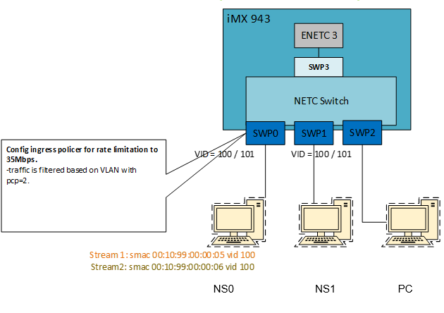

# NXP Application Code Hub
[](https://www.nxp.com)

## NETC: Ethernet Switch Control on M33 with Management Port Sharing via VSIs with A-cores


<strong>NETC switch control PoC</strong> is an application designed to demonstrate the functionality of the NETC switch on the iMX943 platform.<br />It also showcases the <strong>PCIe SR-IOV</strong> capabilities of NETC by sharing the host <strong>ENETC3</strong>, which is connected to the switch management port, with the A-cores through <strong>Virtual Station Interfaces (VSIs)</strong>.The switch is configured using the <strong>MCUSDK driver API</strong>.<br />A <strong>command-line interface (CLI)</strong> is included, offering a set of commands to enable various switch features. Additional commands can be added to extend support for other NETC switch capabilities. The application uses <strong>FreeRTOS tasks</strong> to handle multiple operations in parallel, including:<ul><li>CLI command processing</li><li>RPMSG communication for PCIe virtualization</li><li>PSI-VSI messaging</li></ul>

The current application version showcases the following switch features:

 

Each command is implemented using the MCU SDK driver APIs and activates a specific hardware capability of the NETC switch.

At this stage, the application does not manage entries in the NETC tables (e.g., VLAN filtering, MAC filtering, stream identification, etc). Enhancing the application to support the management of these table entries would  expand its functionality and practical use.


#### Boards: IMX943-EVK
#### Categories: Networking, NETC SR-IOV capabilities
#### Peripherals: ETHERNET
#### Toolchains: IAR Workbench 9.60.2

## Table of Contents
1. [Software](#step1)
2. [Hardware](#step2)
3. [Setup](#step3)
4. [Results](#step4)
5. [FAQs](#step5) 
6. [Support](#step6)
7. [Release Notes](#step7)

## 1. Software<a name="step1"></a>
The application is based on **SDK_25.03.00_IMX943-EVK**.

The Linux version used to enable the VSI is: https://github.com/nxp-imx/linux-imx/tree/lf-6.12.3-imx943-er1

The flash image (boot image) contains:
- u-boot: https://github.com/nxp-imx/uboot-imx/tree/lf-6.12.3-imx943-er1
- system manager: https://github.com/nxp-imx/imx-sm/tree/lf-6.12.3-imx943-er1

## 2. Hardware<a name="step2"></a>
- i.MX 943 EVK board
- iMX8MP (acts as two stations)
- traffic station (PC)
- ethernet cables
- FTDI TTL-232-3v3 cable

## 3. Setup<a name="step3"></a>
The setup consists of an i.MX 943 EVK, an i.MX8MP EVK and a desktop PC.

 

The i.MX8MP is configured to operate as two stations:

- **NS0 (blue)**, connected to swp0 on the i.MX 943 board
- **NS1 (black)**, connected to swp1 on the same board
- The third external switch port, **swp3 (light grey)**, is connected to a PC that is not visible in the image.

The M33-S console is routed through the Arduino connectors. Console access is provided via the three-wire green-yellow-orange cable visible on the right side of the image:
```
J43-6(pin name:  M1_SPI8_SS  ;pad: GPIO_IO12; function: LPUART8_TX) --> RX of usb2serial converter(3.3V)
J43-10(pin name: M1_SPI8_MISO;pad: GPIO_IO13; function: LPUART8_RX) <-- TX of usb2serial converter(3.3V)
J45-12(pin name: GND)    
```
The application configures swp0 and swp1 at 100 Mbps and swp2 at 1Gbps.


### 3.1 Software changes
The following software components must be patched:

- u-boot (https://github.com/nxp-imx/uboot-imx/tree/lf-6.12.3-imx943-er1)
- Linux (https://github.com/nxp-imx/linux-imx/tree/lf-6.12.3-imx943-er1)
- system manager (https://github.com/nxp-imx/imx-sm/tree/lf-6.12.3-imx943-er1)

- mkimage (https://github.com/nxp-imx/imx-mkimage/tree/lf-6.12.3-imx943-er1)

**Changes applied in u-boot**

Apply the patch from *uboot_patches* folder:
```
git am 0001-Disable-NETC-init-in-u-boot.patch
```
In the u-boot default configuration file set the next options as follows:
```
CONFIG_PHY=n
CONFIG_OF_BOARD_SETUP=n
CONFIG_DM_ETH=n
CONFIG_DM_MDIO=n
CONFIG_PHYLIB=n
CONFIG_PHYLIB_10G=n
CONFIG_PHY_AQUANTIA=n
CONFIG_PHY_REALTEK=n
CONFIG_FSL_ENETC=n
CONFIG_NET=n
CONFIG_DM_MDIO=n
CONFIG_DM_ETH=n
CONFIG_FSL_ENETC=n
```
**Changes applied in Linux**

From *linux_patches* folder apply the following patch 


```
git am 0001-enetc_vf-Increase-sleep-interval-between-consecutive.patch
```
To assign the NETC block entirely to M33 core, a new device tree will be used - *imx943-evk-netc-share.dts*.

Copy the device tree in *arch/arm64/boot/dts/freescale* and apply the patch below:

```
git am 0001-netc-Add-dts-for-netc-sharing.patch
```

**Changes applied in system manager**

The system manager config file has to be updated to support NETC
sharing between A and M33-S core.

From *sm_patches* folder apply the next patch:

```ore 
git am 0001-Update-config-for-NETC-sharing.patch
```

**Changes applied in imx mkimage**

To generate a flash image that enables A and  M33-S  partitions
apply the patch from *mkimage_patches* folder:

```
git am 0001-soc-Add-support-for-a55-and-m33s-flash-images.patch
```


#### 3.1.1 Rebuild the images
After applying the changes, re-build the kernel, u-boot and system manager.

The  application from this repo that will run on M33-S, will be compiled using IAR Workbench.
To begin, load the project into the IDE by opening the following file: *<your_path>/imx943-m33s-netc-demo/boards/imx943evk/driver_examples/netc/txrx_transfer/cm33_core1/iar/netc_txrx_transfer_cm33_core1.ewp*
Next, build the project to generate the binary image. Then, copy the **netc_txrx_transfer.bin** to the *imx-mkimage/iMX94/* and rename it to **m33s_image.bin**

In the *iMX94* folder the following files are needed to generate the boot image:
```
bl31.bin -> bl31-imx94.bin
bl31-imx94.bin
boot-spl-container.img
lpddr4x_dmem_qb_v202409.bin
lpddr4x_dmem_v202409.bin
lpddr4x_imem_qb_v202409.bin
lpddr4x_imem_v202409.bin
m33_image.bin
m33-oei-ddrfw.bin
m33s_image.bin
mx943a0-ahab-container.img
oei-m33-ddr.bin
tee.bin
u-boot-atf-container.img
u-boot.bin
u-boot-hash.bin
u-boot-spl.bin
```

Finally, generate the boot image with mkimage:
```
make SOC=iMX94 OEI=YES flash_a55_m33s LPDDR_TYPE=lpddr4
```
Flash the compiled image to the board and reboot it.
Ensure that the updated device tree (imx943-evk-netc-share.dtb) is used during this process.

Connect to the terminal interface assigned to the M33-S core, which is mapped to LPUART8.
You should see a console output similar to the one previously captured.

#### 3.1.2 Updating the pktgen scripts
In the demo there are several scripts that were  used for generating
traffic to the switch:
- pktgen_sample01_simple_v100_p2.sh
- pktgen_sample01_simple_v100_p3.sh
- pktgen_sample01_simple_v101_p2.sh

These scripts can be obtained by changing
https://github.com/nxp-imx/linux-imx/blob/lf-6.12.20-2.0.0/samples/pktgen/pktgen_sample01_simple.sh

and adding VLAN tagging support. At following line
https://github.com/nxp-imx/linux-imx/blob/lf-6.12.3-imx943-er1/samples/pktgen/pktgen_sample01_simple.sh#L53 add:

```
#Add some vlan for pktgen_sample01_simple_v100_p2.sh
pg_set $DEV "vlan_id 100"
pg_set $DEV "vlan_p 2"
```


At the line https://github.com/nxp-imx/linux-imx/blob/lf-6.12.3-imx943-er1/samples/pktgen/pktgen_sample01_simple.sh#L85 add:

```
if [ $VLAN_ID ]; then
	echo "With vlan id:$VLAN_ID prio:$VLAN_P cfi:$VLAN_CFI"
	pg_set $DEV "vlan_id $VLAN_ID"
	pg_set $DEV "vlan_p $VLAN_P"
	pg_set $DEV "vlan_cfi $VLAN_CFI"
fi
```

**Note:** Each script will have its own vlan_id and vlan_p values.

### 3.2 VLAN filtering & Forwarding 


```
#Create two network namespaces one for each interface
ip netns add ns0
ip netns add ns1

# Assign interfaces to namespaces
ip link set eth1 netns ns1
ip link set eth0 netns ns0

# Configure IP addresses
ip netns exec ns1 bash -c "ifconfig eth1 193.3.3.1 up"
ip netns exec ns0 bash -c "ifconfig eth0 193.3.3.2 up"

#On iMX 943 M33
#Port Mask = swp0,swp1, action = kNETC_FDBLookUpWithDiscard
vlan add 100 3 3
#Port Mask = swp0,swp1, action = kNETC_FDBLookUpWithFlood
vlan add 101 3 2


#Add FDB entries, Port Mask = swp1
fdb add 00:10:99:00:00:02 dev 2
fdb add 00:10:99:00:00:03 dev 2
fdb add 00:10:99:00:00:04 dev 2

#Test1: From NS0 send traffic untagged
ip netns exec ns0 /home/root/samples/pktgen/pktgen_sample01_simple.sh -i eth0 -m 00:10:99:00:00:02 -s 1500 -n 0&

#Test1 expected result: traffic is received on NS1(FDB forwarding)
ip netns exec ns1 ifconfig eth1 promisc
ip netns exec ns1 nload eth1 -m

#Test2: From NS0 send traffic tagged VID=100
#Stop the previous pktgen
ip netns exec ns0 /home/root/samples/pktgen/pktgen_sample01_simple_v100_p2.sh -i eth0 -m 00:10:99:00:00:03 -s 1500 -n 0&

#Test2 expected result: traffic is received on NS1(VLAN filter + FDB forwarding)
ip netns exec ns1 nload eth1 -m

#Test3: : From NS0 send traffic tagged=101
ip netns exec ns0 /home/root/samples/pktgen/pktgen_sample01_simple_v101_p2.sh -i eth0 -m 00:10:99:00:00:22 -s 1500 -n 0&

#Test3 expected result: traffic is received due to flooding on NS1(VLAN filter + FDB is not matched flooding)
ip netns exec ns1 nload eth1 -m

```
### 3.3 Ingress port filtering


```
#Keep setup  from previous section
#Change MAC on NS0 to
ip netns exec ns0 ifconfig eth0 hw ether 00:10:99:00:00:03

#On iMX 943 M33
#Source Port=SWP0, action=kNETC_IPFForwardDiscard
ingr port filt add smac 00:10:99:00:00:03 sport 0 action 0

#Test1: From NS0 send traffic (tagged or untagged)
ip netns exec ns0 /home/root/samples/pktgen/pktgen_sample01_simple_v100_p2.sh -i eth0 -m 00:10:99:00:00:02 -s 1500 -n 0&

#Test1 expected result: traffic is dropped on SWP0 ingress. No traffic received by NS1
ip netns exec ns1 nload eth1 -m

```
### 3.4 Traffic flows to VSI1


```
#Keep setup  from previous section

ip netns exec ns0 ifconfig eth0 hw ether 00:10:99:00:00:33
ip netns exec ns1 ifconfig eth1 hw ether 00:10:99:00:00:02

#On iMX 943 M33
#Source Port=SWP0, action=kNETC_IPFRedirectToMgmtPort
ingr port filt add smac 00:10:99:00:00:33 sport 0 action 2

#Test 1
#Reflecting the packets to PC (red flow)
#On iMX943 execute:
management 2

#On NS0 execute
ip netns exec ns0 /home/root/samples/pktgen/pktgen_sample01_simple_v100_p2.sh -i eth0 -m 00:10:99:00:00:02 -s 1500 -n 0&

#On PC:
sudo ifconfig eth1 promisc
nload –m eth1
#Test1 expected result(red flow): Notice a load of 11Mbps on PC

```
#### 3.4.1 VSI start-up

For enabling the VSI on the A-core, connect to the A-core console and reboot the Linux domain. 
This step is required because the M33-S core has already configured the switch and owns the entire NETC block, except for ENETC3 VSI. 

 When the PCIE bus is scanned during Linux boot, the device id 0x080b (defined in M33-S application) which represents the ENETC3 host controller, is detected but not completely probed on the A-core as the PSI is owned by the M33-S. The detection process on Linux domain is managed by M33-S through rpmsg mechanism.

 To probe the VF1 of ENETC3, user will have to trigger a PCIe bus rescan for the NETC:

 ```
 echo 1 > /sys/bus/pci/devices/0000:00:00.0/sriov_numvfs
 
 ```
 **Note:** When Linux partition is started, the PHY owned by swp2 will be reset during the boot process. As a result the PHY will be in an undefined state while the NETC control application is running. This determines the drop of traffic that ingess / egress swp2.
 To overcome this problem, please run the following command in NETC console:

 ```
 reset_rgmii
 ```
#### 3.4.2 Reflecting packets from M33 to Linux domain - dark blue flow

```
#bring up the linux interface that was probed
ifconfig eth0 promisc

#capture packets
tcpdump -i eth0

#On 943 M33 execute
management 3

#Test expected result: Notice packets received in tcpdump
```

#### 3.4.3 ssh session NS1 -- Linux domain

```
#On iMX 943 M33
fdb add 00:00:fa:fa:dd:a0 dev 8
fdb add ff:ff:ff:ff:ff:ff dev 15
#Only if it was not added
#fdb add 00:10:99:00:00:02 dev 2

#On Linux domain set ip for VSI1
ifconfig eth0 193.3.3.3

#On IMX8MP
ip netns exec ns1 bash
ssh root@193.3.3.3

#Test expected result(light blue flow): ssh connection from NS1 to Linux domain
```
## 3.5 Stream identification


```
#Keep the same setup from previous sections
#Change MAC on NS0 to
ip netns exec ns0 ifconfig eth0 hw ether 00:10:99:00:00:05

#make sure to kill any pktgen script that was running

#On iMX 943
#Add stream rules
stream add smac 00:10:99:00:00:05 vid 100 index 1
stream add smac 00:10:99:00:00:06 vid 100 index 2

#Test1: From NS0 send traffic tagged with vid 100
#traffic belongs to stream 1: smac=00:10:99:00:00:05, vid = 100
ip netns exec ns0 /home/root/samples/pktgen/pktgen_sample01_simple_v100_p2.sh -i eth0 -m 00:10:99:00:00:02 -s 1500 -n 0&

#Test1 expected result: traffic belonging to stream 1 is received on NS1
#Check switch statistics of stream 1 on iMX 943: counter must increase
stream table stats stream_index 1

```

## 3.6 Per Stream Filtering and Policing (Qci)



```
#Keep the same setup from previous sections
#Change MAC on NS0 to
ip netns exec ns0 ifconfig eth0 hw ether 00:10:99:00:00:05


#On iMX 943
#Add a stream filter entry for stream 1. Stream is filtered based on VLAN pcp=2. The entry is policed by adding policer 1. 
stream filter add stream_index 1 prio 2 policer 1

#3.725 bits per second * 10000000 = 34Mbps. policer add pol_id 1 cir 10000000 cbs 2000 eir 0 ebs 0
policer add pol_id 1 cir 10000000 cbs 2000 eir 0 ebs 0


#Test1: From NS0 send traffic tagged with vid 100 and priority 2
#traffic belongs to stream 1: smac=00:10:99:00:00:05, vid = 100
ip netns exec ns0 /home/root/samples/pktgen/pktgen_sample01_simple_v100_p2.sh -i eth0 -m 00:10:99:00:00:02 -s 1500 -n 0&


#Test1 expected result: traffic belonging to stream 1 is received on NS1
#It is filtered by matching stream filter table entry with priority 2 and policed at 35Mbps
ip netns exec ns1 nload eth1 -m

```
## 3.7 Stream gating


```
#Keep the same setup from previous sections
#Change MAC on NS0 to
ip netns exec ns0 ifconfig eth0 hw ether 00:10:99:00:00:06

#On iMX 943
#Add another stream filter entry in stream filter table for stream 2.
# Stream is filtered based on VLAN pcp=3. This entry will be “gated” by stream gate entry 1.

stream filter add stream_index 2 prio 3 stream_gate_id 1

#Gate entry 1 has a gate control list with 4 gate states:
add gate instance 1 stream_index 2 cycle time 1200000 num_gates 4 gcl_id 4 gates states 0:closed:300000 1:closed:300000 2:closed:300000 3:open:300000

#Test1: From NS0 send traffic tagged with vid 100 and priority 3
#traffic belongs to stream 2: smac=00:10:99:00:00:06, vid = 100
ip netns exec ns0 /home/root/samples/pktgen/pktgen_sample01_simple_v100_p3.sh -i eth0 -m 00:10:99:00:00:02 -s 1500 -n 0&

#Test1 expected result: traffic belonging to stream 2 is received on NS1
#It is filtered by matching stream filter table entry with priority 3 and rate limited. Notice that the gate is opened in state 4 only for 300000ns

#a rate of 23Mbps will be noticed
ip netns exec ns1 nload eth1 -m

```

## 3.8 Time aware shaping (Qbv)


```
#Keep the same setup from previous sections

#On i.MX 943 create a third stream
stream add smac 00:10:99:00:00:07 vid 100 index 3

#Change MAC on NS0 to
ip netns exec ns0 ifconfig eth0 hw ether 00:10:99:00:00:07

#Test1: From NS0 send traffic tagged with vid 100 and priority 2
#traffic belongs to stream 3: smac=00:10:99:00:00:07, vid = 100
ip netns exec ns0  /home/root/samples/pktgen/pktgen_sample01_simple_v100_p2.sh -i eth0 -m 00:10:99:00:00:02 -s 900 -n 0&

#Test1 expected result: traffic belonging to stream 3 is received on NS1 close to line rate
ip netns exec ns1 nload eth1 -m

#Test2: configure traffic shaping by adding a Qbv schedule on SWP1 with 2 GCL entries. Traffic will match TC=2
tas add port 1 maxsdu 1000 1000 1000 1000 1000 1000 1000 1000 base time 100000 num_sched_entries 2 schedules 0x04:800000:S 0x0:800000:S

#Test2 expected result: Notice the rate of the traffic on NS1. It changes to almost half the rate. The traffic is shaped: half the cycle time the gate is opened, and half is closed.

#Test3: change  the SDU to a lower value than 900B for TC=2
tas add port 1 maxsdu 1000 1000 800 1000 1000 1000 1000 1000 base time 100000 num_sched_entries 2 schedules 0x04:800000:S 0x0:800000:S

#Test3 expected result: rate drops to 0 because the frames are bigger than maxsdu for TC=2, which is 800.

```
## 3.9 Qbv Traffic Shaping with frame preemption (Qbu)


```
#On NS0
#bandwidth: 100Mbps
#stream4(preemptable): 900B frames 50% bandwidth smac = 00:10:99:00:00:10 dmac=00:10:99:00:00:13 vid = 201 prio = 3
#stream5(express): 100B frames 50% bandwidth smac = 00:10:99:00:00:11 dmac=00:10:99:00:00:14 vid = 200 prio = 2
#On iMX 943
# port mask includes ports SWP0,SWP1,SWP2
vlan add 200 7 3
vlan add 201 7 3

#forwarding to SWP1
fdb add 00:10:99:00:00:13 dev 2
fdb add 00:10:99:00:00:14 dev 2
#permit all the traffic first, as the previous test used Qbv and shaped traffic
tas add port 1 maxsdu 1000 1000 800 1000 1000 1000 1000 1000 base time 100000 num_sched_entries 2 schedules 0xff:800000:S 0xff:800000:S

#Test1: From NS0 send 2 Streams
taskset --cpu-list 1 mz eth0 -c 0 -Q 3:201 -a 00:10:99:00:00:10 -b 00:10:99:00:00:13 -A 193.3.3.2 -B 193.3.3.1 -t udp -p 900&
taskset --cpu-list 2 mz eth0 -c 0 -Q 2:200 -a 00:10:99:00:00:11 -b 00:10:99:00:00:14 -A 193.3.3.2 -B 193.3.3.1 -t udp -p 100 &

#Test1 expected result: traffic received on NS1 line rate
ifconfig eth1 promisc
nload eth1 –m

#Test2: on iMX 943 create a Qbv schedule with 2 GCL entries
#TC 3 - will be preemptible, TC 2 - will be for express frames
tas add port 1 maxsdu 1000 1000 1000 1000 1000 1000 1000 1000 base time 100000 num_sched_entries 2 schedules 0x04:80000:H 0x08:80000:R

#On NS1: Enable preemmption
ethtool --set-frame-preemption eth1 fp  on
watch -n 1 --difference "ethtool -S eth1 | grep -i mmc_rx_fpe_fragment_cntr"

nload -m eth1

#Test2 expected result: express traffic is shaped and occupies half of the cycle time on TC 2. The rate is half of 50Mbps that is 25Mbps. #The preemptible TC 3 traffic class, will schedule traffic and will use the HOLD/RELEASE mechanism  to prevent the 900B frames to be scheduled and reach in the express traffic window. Packets will be fragmented.

#Test3: on iMX 943 create two Qbv schedules, TC 3 and TC 2 are express traffic classes
tas add port 1 maxsdu 1000 1000 1000 1000 1000 1000 1000 1000 base time 100000 num_sched_entries 2 schedules 0x04:80000:S 0x08:80000:S

#Test3 expected result: traffic rate is aprox half of the 100Mbps that is around 50Mbps (including both streams). In this case traffic is not preempted. No fragmentation happens on NS1

#On NS1
nload eth1 -m

```

## 3.10 Exercise: Enabling credit based shaper (Qav)

This section is an exercise to familiarize the user with the PoC code.
The requirement is to enable Qav hardware feature on the NETC switch. Below is a command example that could implement credit based shaper feature:

```
cbs set port <switch_port_id> num_sched_entries <num> <tc_num0:bwWeight>[:hiCredit] ... 

cbs set port 1 num_sched_entries 2 2:15:23 3:65

#Explanation: Enable qav on swp1 and set 2 entries:
-traffic class 2: 15% of port speed shaped Tx traffic and 23 credits per bit
-traffic class 3: 65% of port speed  shaped Tx traffic and 65 credits per bit

Note: swp0 and swp1 are at 100Mbps while spw2 is at 1Gbps (see section 3. Setup)

```

### 3.10.1 Implementation Tips

The function responsible for  enabling Qav  in  NETC switch will be:

```
diff --git a/boards/imx943evk/driver_examples/netc/txrx_transfer/cm33_core1/netc_txrx_transfer.c b/boards/imx943evk/driver_examples/netc/txrx_transfer/cm33_core1/netc_txrx_transfer.c
index c2530facb..d8ff6a1ae 100644
--- a/boards/imx943evk/driver_examples/netc/txrx_transfer/cm33_core1/netc_txrx_transfer.c
+++ b/boards/imx943evk/driver_examples/netc/txrx_transfer/cm33_core1/netc_txrx_transfer.c

+typedef struct {
+    uint32_t tc_id;  // Traffic class id
+    netc_port_tc_cbs_config_t config;
+} CbsScheduleEntry;
+
+
+/*!
+ * @brief Configure the Credit Based Shaper for port Traffic Class
+ *
+ * @param handle
+ * @param portIdx
+ * @param tcIdx
+ * @param config
+ * @return status_t
+ */
+static inline status_t APP_SWT_TxCBSConfigPort(swt_handle_t *handle,
+                                           netc_hw_port_idx_t portIdx,
+                                           netc_hw_tc_idx_t tcIdx,
+                                           const netc_port_tc_cbs_config_t *config)
+{
+    assert((handle != NULL) && (config != NULL));
+
+    return NETC_PortConfigTcCBS(handle->hw.ports[portIdx].port, tcIdx, config);
+}

```

The input structure is represented by *CbsScheduleEntry* with the following arguments:
- traffic class id: *tc_id*
- bandwidth weigh: *config.bwWeight* - represents % from the total bandwitdth of the port that will provide the shaped throughput for the Tx traffic. E.g: config.bwWeight = 15
- credits per bit: *config.hiCredit* calculated as: *(NETC_freq / portTxRate) * 1000* if no argument is provided.

```
+        if (entries[i].config.hiCredit == 0)
+          entries[i].config.hiCredit = (NETC_freq / port_tx_rate[port]) * 1000U;


```
The value of hiCredit  will be further updated to:
```
+
+        float hi_credit_f  =  (entries[i].config.bwWeight / 100.0f) *
+                                    g_swt_config.ports[port].txTcCfg[entries[i].tc_id].sduCfg.maxSduSized * 8.0f *
+                                    entries[i].config.hiCredit;
+
+        entries[i].config.hiCredit = (uint32_t)hi_credit_f;
```

and will compute  the total number of credits which is equivalent with:
credit per bits * total number of bits (hi_credit_f).

NETC_freq and port_tx_rate are computed as follows:
```
@@ -2040,6 +2184,10 @@ skip_phy:
         else
           g_swt_config.ports[i].commonCfg.pSpeed = 99;

+
+        port_tx_rate[i] = (g_swt_config.ports[i].commonCfg.pSpeed + 1) * 10000000U;


@@ -2195,6 +2343,9 @@ skip_phy:
     {
         return result;
     }
+
+    NETC_freq = timerConfig.refClkHz;
+

```

Once the input data is received, the qav configuration can be applied for each traffic class defined in the input command:

```
+
+
+        result |= APP_SWT_TxCBSConfigPort(&g_swt_handle, port, entries[i].tc_id, &entries[i].config);
+    }
+
+    if (result) {
+       PRINTF("\r\nCould not configure Qav entries for port. Error: %x \r\n", port, result);
+      return;
+    }
+
+    PRINTF("\r\nAdded Qav schedule\r\n");
+    PRINTF("  Schedule entries (%u):\r\n", num_entries);
+    PRINTF("\r\n");
+    for (uint32_t i = 0; i < num_entries; i++) {
+      PRINTF("    tc: %x, weight in %: %u, hiCredit: %u\r\n",
+              entries[i].tc_id, entries[i].config.bwWeight, entries[i].config.hiCredit);
+    }

```

## 4. Results<a name="step4"></a>
The results observed in the previous sections can be replicated using separate physical machines, rather than relying on a single station with multiple ethernet interfaces assigned to distinct network namespaces.


## 5. Support<a name="step6"></a>
If help is needed please open a community ticket with the topic NETC followed by the problem description.

#### Project Metadata

<!----- Boards ----->
[]()

<!----- Categories ----->
[](https://github.com/search?q=org%3Anxp-appcodehub+networking+in%3Areadme&type=Repositories)

<!----- Peripherals ----->
[](https://github.com/search?q=org%3Anxp-appcodehub+NETC+in%3Areadme&type=Repositories)
[](https://github.com/search?q=org%3Anxp-appcodehub+ENETC+in%3Areadme&type=Repositories)
[](https://github.com/search?q=org%3Anxp-appcodehub+VSI+in%3Areadme&type=Repositories)
[](https://github.com/search?q=org%3Anxp-appcodehub+Qbv+in%3Areadme&type=Repositories)
[](https://github.com/search?q=org%3Anxp-appcodehub+Qci+in%3Areadme&type=Repositories)
[](https://github.com/search?q=org%3Anxp-appcodehub+PSPF+in%3Areadme&type=Repositories)
[](https://github.com/search?q=org%3Anxp-appcodehub+TSN+in%3Areadme&type=Repositories)
[](https://github.com/search?q=org%3Anxp-appcodehub+SRIOV+in%3Areadme&type=Repositories)
[](https://github.com/search?q=org%3Anxp-appcodehub+NETC%20switch+in%3Areadme&type=Repositories)


<!----- Toolchains ----->
[](https://github.com/search?q=org%3Anxp-appcodehub+IAR+in%3Areadme&type=Repositories)


Questions regarding the content/correctness of this example can be entered as Issues within this GitHub repository.

>**Warning**: For more general technical questions regarding NXP Microcontrollers and the difference in expected functionality, enter your questions on the [NXP Community Forum](https://community.nxp.com/)

[](https://www.youtube.com/NXP_Semiconductors)
[](https://www.linkedin.com/company/nxp-semiconductors)
[](https://www.facebook.com/nxpsemi/)
[](https://x.com/NXP)

## 6. Release Notes<a name="step7"></a>
| Version | Description / Update                           | Date                        |
|:-------:|------------------------------------------------|----------------------------:|
| 1.0     | Initial release on Application Code Hub        | Aug 7<sup>th</sup> 2025 |
